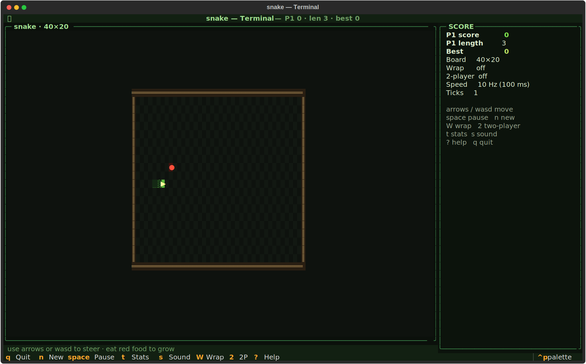
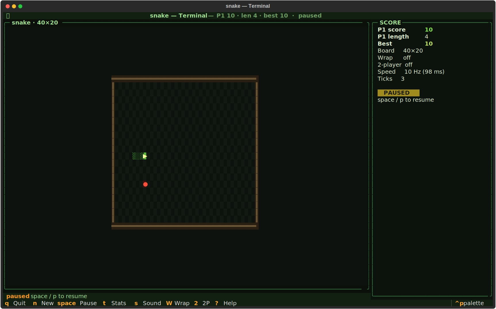
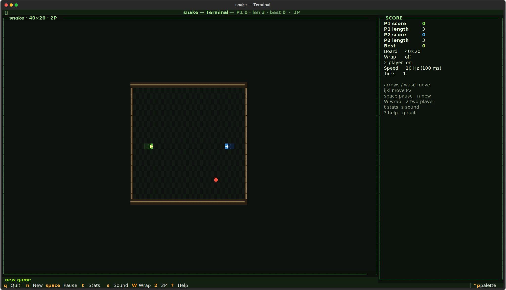

# snake-tui
Grow. Turn. Don't crash.





## About
The snake eats. The snake grows. The snake cannot stop. Configurable board, wrap toggle, two-player hotseat with the classic head-on-head collision rule, 180° reverse guard, per-config high-score table, a tiny synth bleep. The oldest genre, perfect the way it was on the Nokia.

## Screenshots


## Install & Run
```bash
git clone https://github.com/akakabrian/snake-tui
cd snake-tui
make
make run
```

## Controls
<Add controls info from code or existing README>

## Testing
```bash
make test       # QA harness
make playtest   # scripted critical-path run
make perf       # performance baseline
```

## License
MIT

## Built with
- [Textual](https://textual.textualize.io/) — the TUI framework
- [tui-game-build](https://github.com/akakabrian/tui-foundry) — shared build process
